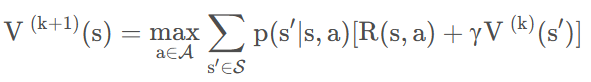

### 强化学习第二次作业

**学号：1120211392     姓名：何祖望**

这次实验主要是补充代码文件MDP.py这里考察了值迭代、策略迭代和改进的策略迭代这三种算法。

 每个向量的大小为，其中V向量即为每个状态S下的V值

首先是**值迭代**：

  

 

我使用了数值法来实现值迭代，遍历每个state，再遍历每个action

 使用贝尔曼方程进行计算

选择使V值最大的action来执行

然后是**策略迭代**：

策略迭代分为策略评估和策略改进两步，

策略评估![img](data:image/png;base64,iVBORw0KGgoAAAANSUhEUgAAASoAAAAfCAYAAABQ+oCFAAAAAXNSR0IArs4c6QAAAAlwSFlzAAASdAAAEnQB3mYfeAAAABl0RVh0U29mdHdhcmUATWljcm9zb2Z0IE9mZmljZX/tNXEAABEXSURBVHhe7V0xbNtYEh0K6Z3erSjgHLcOEDnXrldyEV9xPkCN3VjONbECrKsIcuxoKwUXO1XEFBs3CtbN+oBYiuuNdMBpu1N8WElXul9fH/Le/E9SJEVKpGUlyh7ZLEKT/PPfzJ8/82a+9tb+/j7FV4xAjECMwCwjcGuWhYtlixGIEYgRYARiRxXbQYxAjMDMIxA7qplXUSxgjECMQOyoYhuIEYgRmHkEYkc18yqKBYwRiBGIHVVsAzECMQIzj0DsqGZeRbGAMQIxArGjim0gRiBGYOYRGOmoSrk5Y1ktUIunkT6kXnOHagcHyiSzKuWWjO2NMmkt8VWifJ161czE351Epknezc2dG2pBziV92KOVq9pE+Ewiy6y8O4uYsN0dVcp0Qut0XJ3cjv2wDjvvWVwDudvnemqnpRjCjrvUKqiJ/f0D/ufULx5788dF5cmbXcqoycTBwfC4Ix3VQe1KafYOhbOi9dWJnYl0fFkiLOj9lZqydHlulBfUib87dSRHDFC7WlF6hySc1WIqSdT+ktKEH7tUwoahZEnzeyWdpnzxmObb13O6ozApLV0aSlbD/mTg+5NtemFny2Muq+e0WD+mFcwJm23YVyM9F8YWZnUN1H5bSXSPSDirRTVJLXZRJkzAT0+sasrWO520rJLY93EkkYDyPMxjfzhe0h9uppTynXd6SysNOcnQqd+ki7BUyhlHyyq1ODLbScI5YU3PryiIQCaZ4wy9m6e1DOb0lTiqg4O2UsUmRNiENEe0LCKPjSwVsio7E2MyZzKMSb/b4T2bsD/R1WfA6ks4RqQJvrbwdayBPD3IKFQd+Cnq96AzQ+psWtdBrZ149eFMf5hYVejFr/peAc7K4RDHO6reBVK/NK1Palj9MzrhDCmf+qojKD9F9S4wsfQ6sR4/w9ojufiI6kaV2hOm4sJtOKJlGIxSKuaNAqKeTrdP89e0zCBMOOrg46VXvFNN+ZJR455IySdzuOEFHWkLM74G+h8HduycMUc8T1lnb5/RNE8GY/NMvDrbQvS2qbxY/aAXSiU7DRzrqMQOiEW4iqxmktincXYiuK781xR2hLBPuRg+nwMW/Ia6JzjDiR2j2IR477jZlPVzYxKkpv4RuFBssocw3s8RuI+b9yyvgVLprr6dIMXYUimVoM/GTw3pLrNLL9Ipevy8QY+1LFm/meByVF6SL53P0+U5THmx6BsFcSjb2N6gstaShDuMIn8IbsNBKFuEPJaWuJDj8n8MJtH359s3QjyPk0OmM2UqMIHvGDe3NGdUykh9WpC73nTtukNYwDEUixdULi/QsbOo0O8SRyWWAxayHFWoXNBEJHrYa3L0YM9TEq5M07nvjxsvSX3i1BkBgrxaBVIVfIiDcg+JPw4PyzhkGjacpjROmblCFO1Z4BYhXYC+5cW4+XBZHkz4SSsFE28FFB2Gv49noa9jFFuosU0biPIYU+eYLq7NmcIKqkE69FGbrIVV1p4TCwi9gaO7cnB0oTD1mbeYu1mUmmQNYHwddqXYdtVt0o7aBywbJGWXNoy17XIypdxd/ajyTPHqTMsm3c7Ikv1BhjQz77O4KQN8lR/BDn3h22XHt1lfZ/TmVZaU9w9pc7VKTaSM+bM3kAvkPFI56Eukd1X5Uep+2IEdkx05HRzUErk/39MfP/5eedHN6AVVRlW2o5KE4x61uArXlFU4sahgs2mfvE+Ar0jOqY5Fl0liIW2rVChUOCUxrJSECfkVuMXi5Z6R1fKOdOVmkqRxcmT6Ddre6NJu85gIC73Q6VKuWjKS/SNarqTgdHq0gPsnjjTHH4sTQ81imWCROSuffREpDlLj/tEGnaaOqdlbwHAFOjnr04q5rCVHMbx4Qo+3sk9G0YeMdoQL4/Cw9GLLki/a6WMpB/kqbPhsQ1ioDgfrktFw2IcPl+XFhKd/0J5H0SEdWHSwSGZhf/i+5ZjZFbOutk/X6NjYpTPWYfkMNloyWA8W19YZKvj0iDPycVRDAzYr7BI23MZ8efPayEJvXRroLaSt+81bzP0G1kD/pcOuUgW66Pfo6PlzSu02yajyJpYCr7hNdb2qZxXJ75TuXurLakZhTLvAFBF4ov9y+VMqqyr5uq7vZQekdb/+I/0DToWXunVBZ4nuYdqfYM/d1u+nskpz6wzfzuLbkOE+ZGB9/eeI/nr6gN58+o7O/oh732P8zI6uylQu8ap7qHdSO4qxnvWN3pKpRXxFo3/3iOBiRLopHJWVywui29EqIF/ggp87dLZ2MfG8GV2w21niSMnnGoTEaxNzKs7Ph5GDOZd5eAokNy7ZhPHMt3FfFfetYsFoLIYre4KTQFRiZU/MwaBaRqTOub4r5R5ePFHHC4qCBnrMyoLFWL2YsrSyBNcpZN3bA5+TztMhoiR3NCG5niH7WF2nNKqdXi7Li4nbJIYjOJceHfa3tIhoEQyu0CF0VTtoU249bRQKJ3TW3xl8VqSwcDYo0rQt6suMEPj9INbeZZemU661r5RiPm10TZsPY2OWIKPmPekaYJ5I2tVtHeMpnfJzWmtWCVQlnFLNuLto6NTqKNhv8QyvaU7l4KQ4agGm7KQ4Minl/kL3TJ2JB82L+SmkOaQmFWEMbgbRTbBzVLSNqKh5D99G9CS/XTOW7hg68FYSalZEa7VnrC9ERzsnSr3/iAoInQTH1fso9PXuUZKyUONQEVZdwNavCLsibIR8CUclc3kst6K7v0QuikV7EdqTsnL/Y/l8Djtxz9yJ83UfgjeE0fg5uHH3bA4ilBwBOywTnHRIx8guavC2o7FwV6sGUcmwA/bdXRunEmcHT3et8QKI+0h4WLL4tAnASbmgD5LRTz9BmAyiyeGiQ9D32/P7Q1Vha7e9wG5rEf1spxwBRi8sqLSQxiy0Ms31moYVQXI1WpSl7bWBVHCMjY2yBfkhSRGMcpzj7F18RkQ+RFvFVwQWJZBL6r98Rq/xXL74iFIjnuNvclp5tPxUgWHSqoOfEvfvP1UM097s9f+yjG/DrT0xv21W56CvxMrVW0Lgb19JFcGOohHry/KLXEVMv3iDsdDqELJX65YNsIerCDKswfMkPCQu4/wcPSqL63b47AXcWrQ3SWpGliPAUBqVE1BwTeFwg7Dg+chqjofvMKs4fqmx3/Pe0nzk8cyILH043NMWFY8obQJWpDBUB/Ej4wMxkRuFV/ZRGPguXLHbkh3FiUhl+ZKKTUc0FWbF4xlEAUrpuG5ccDsGbBl8mMF8mJXaR8J0hC0IB2NSBJOuARH5wA6/4xYCOCKORmxHYwYVYjwzQlr7ViHNGSL1P0pHhxTAYhrh/egEN9PrjnsCQ1NnLwYpmu284C+8bQz++roj9dVDdIQ8rmSAo7p/qTz5OUkZv2gqQHeIqMxII73griJZwA8tCisy8ZLhV5zj+w4zOhUIaVVDj0WUw2dRCd7lsogmQIvs9sdC8icQwNtaEVA186v++PNTEcezoiDfKl14PIK4Mj9NDJ712Acetkh3V3YVVEkMlN2SOyQtkExhOSIIwha9gpCKozF4qWtEU3K2nFZWmz1jTRRAkMZIHtXkWMNjip1sZAX1JtaA7ZAWU4iSOBrZl3SG6Wg4IsoiSjGM3qejjgLPu0DI5Fyp3PufNPwbmYHzD07n5XRq0NlrPL3lagC1MHngir4CV3FShb7gVM2Qqo9ozHjyAdFgtMZR3/YEYZyoJvAVttFTvlOhVNWd+tmL1usIr+ufxrwXJMdQNMPOZ2MOZDrvoMHEvhMLb2tFIF/kU/1hkv1EAjqyj2z8eNGaJf3xCEc0j4J64LyLLtI9CJMoEdyocZk8X8uToXFRZBfEdwUbzZVPh7vHoXm/KeSHiXMFF9wNlvM8Net50TV/2qiO7B/zw3Q8dwgJJl0Drshn4FHeV3bQSY709LsMFTjMArHtu+mAAAfnjhSvSIXUwNHZsiP6uulGT+6NerBl6Fqnp/zaPdI3nxepuTMm5RNOHw7SEfXBUZl5euuCODqzlbC2SC2UPXn3EpWQ0xR2sLaosghD0U5pqYedBySkKK0j5OisY5fzNiBaKdcNHMFxgh9ZDsfLOY6kKuykvGe+omEhd0lZcMjNXRoV2pWtGebuSiADq2a7QiVVxCkzEN14VrZLnFKjlJMcSUjs5RRaIt+3vlvGmHy+MAoeFicUZq/g9IhJbdIGBLZspWDSHtEHUqW2w9EHYeKMKFQHVr5yW20vCzjy4nN2UmXQIM/GxiKCqR3X+IM5mbo0q7xDZ1RZRy2NKo1V4ZTY7hvYTJxd81EwDbQFFijCGlhyVMclUe4492ZGPsZFH5U2VVcpRyxzBtWQfP0DnI/krJDXJAS5roHE7u0grUVUhTaF7Q2Q6/ekzrJW3sjiiTRR2nH/aFu/nNslrZBMLOW5oUIS7D3cr+C+oiQT8OefXmt/V951s3oW7QN46xPaJJQy9NXCe17eSb0j9bW5CX19eEQZeMNRp5isTe0PLDck4DztlszTD5GnF0Cwoz0uj36h3SraDRqUT2ui76lj9rJYkUem2gP9jDK2yVHtnaNSVOTuX5+zYVNqKmRQo8hhkbCFjWW6QI/Myvzwma+oWGTgsdOahjC24+4fQ9PaYb6DVg30PZ0Am2Ps0HDoqcU0Fjx6TDowFtxj8jcK9smdIuVPcD4POuFGxjR2xuOqPI4UFg/Zz2SyE5BlD7zMuH42xrnu1Pcej+1/mDwIk0CshB7rlO9khf3hMvbAefJZQz6X5+dMLV0ytxhEoLMufSuE1gfBdeXRL9VBVQmjGlzxxKTQ31Z1RYhhbWzU/MalhWE2DH5GpG0sI5WR+sGN8SVkblIh6SbWv7V0BiYdl4480NYZKuAuB/jtn0w7Tkg7ZifFziazhPuvNaR4nvulOm19XKXVlNCXzn1nrK9WBu9dDR8otgj1xRApn8WB0dY7eoyo778m2S5SPy7Vz4Oq3xcNP5Jr4mRocE+Whq2LjQB/RNeo1SHEFWD/vnVfHiOsZsY8F0UO7uOx/9dgAbJGxYK/yT1iErbB/L1yWcdFuJpkYWbxeVGw5x1+oBMeNLpeXDgIfMf3s/nh7B3bto0gTALuC8yH5sVijT4HwY5y3LEY4djBOxUqDTQXu41J4r4CM16x+6WkGt08a1gbC7IF/mbkNWCmiE66aMBPrVFB0wb8lCmz92gLN05612igzv45n3DasdUNzn1U3+DszDemfdv3kc7Nf/OU9sUfzAv62h9hSumtOmmrIap8jQo9bt2jv/3Aaewg8hp7hGYSnzLgpyY/gjOJHPG7vx8EJLc0nlu0HGAVeYqWzdLlxAesr4dhlDVgPZuv+/0MTZ8u7MrccKfT9aSb/lslbgzdnFN++Bm9XGNSPtm1/lS554mmWMqpOipvX8/0YYlH+D0iwLzN6ZoBNg6nCUwCPOzvonGkY8BZLWeXcYr7GL8Gcb2frrkurlHWgKhg1gMOUL//SfRFudoKrivUlN+DvvTTNV3ZpZd0f8OgHzzHZPyG5+M4D++vKv+Ck2ppsmHU+dxUHJXVzavymSnucnYcxZgyRvHnf2cIWO0RmmZypebxrijTZGfV7O0aDTQll2kdvVLT+eE8p0zXWQP2qQafyUmCmXtTHzKPpheS7p9BiYLHNJ+1OCZkp+C2ce7vA1o+HGf5/MbO3b7U72+gt+pNl17xD+fNR/zhvOtOSHAOSGg5bw7irq777fi9/y8EBEdk86duTi4KEgc1yauugIOd1g/nOeW56TUgf2pFcsLMo03z51ai4Op9VnBjNn/1C7199svYz9V+AxeGqbXf1gIZ06lEVGMlix+IEYgRiBGIgEDsqCKAFT8aIxAj8GUQiB3Vl8E9HjVGIEYgAgL/A2VOWl+2lXogAAAAAElFTkSuQmCC)函数有两个假设：总是采用policy策略进行执行，另外，V已经收敛，所以这一步求解的是在policy策略下的V值的收敛值。

求解的是方程组：

![img](data:image/png;base64,iVBORw0KGgoAAAANSUhEUgAAAPYAAAAfCAYAAADUWTCCAAAAAXNSR0IArs4c6QAAAAlwSFlzAAASdAAAEnQB3mYfeAAAABl0RVh0U29mdHdhcmUATWljcm9zb2Z0IE9mZmljZX/tNXEAAAo5SURBVHhe7Vw/c+JKEm9Rm/tyUkTgIvVWLf4AHHoJkQMSMghN4oyCh47MV/UgRJccCVdHRGKozc9s1SPlOTBK/QH8BZj79YyEhBCYfwYbS69e7SKNZrp7+tfT/7Tf6vU6RVckgUgC5yWBb+fFTsRNJIFIAiyBCNiRHkQSOEMJRMA+w02NWIokEAE70oFIAmcogQjYZ7ipEUuRBCJgRzoQSeAMJRAB+ww3NWIpksBRgF29ehGaMaHm9JFeu6Z2zmL/Srye8z7uw9spdKD6/WUWy060P54fqaxT7CjANsdxrV6PM6j3kdenePcr8fopNuQERJ5CB8w/47HfGWP/MYlbznYGdrWaF61SgcrWiIqDKbX1ByoVymSN0vjdofi4K0/mq5eaMCyidHNKmVd177NdX4nXz7Y3x6L3FDqANWfAmKYw9gyMDRYwZhmJWL1uiu8vtVnWIi3dfKZRWZf3vlWrV6KkGQTsOVeRBqJNY1O5zC4w508HAqA1NXv4QHT3SAPSqNG/p9JlDj8F3bWuSW880PSxKrqYI9seUNEyiJIJovGxtmH9Oss8+8anYZgqnmHiJ5+Z148h8Y9HRVCvV1HoHkj76sAuOLOHLQdjMWDsnwsYSwJjz+J2plM1RvSdiv/KSoyNHEa+meZYa0+bYqKXcbOIONgDNY+RwJwA+HiDT2YGNd/vjl+1atYWrQnRKJXDaTzWuuaY8hckaPREU1dS9jNNMG8F644/CLBdngk8W+kmjNAtsRFiqzws6WQYOngV4pi8VvMX4lrv0c0XyEOcGuYKZKCiOKBpOyv3XgHdO9Tm+/FbAiHk/vq+C86wLAFjM2BMY4yNykYs/loX+b/RDBjTbAEsgw/hYuzvGlm4R4h4lSueSFIKf4zSlwQ+iCf0Lp0u+QeE4LrX3rMpPcH1bnayYF6hdvoEC5C+IR1/l3emT3Le+e9T76pvfdgkkPqb3Fi+bZpdrXrXFGkLgO8PCSGL7/rcvH4gsZ+eFAcIAwfUc6Av6Wkq4GjuqQM74cymp18/qPnvLJXbQK1pkv3XiAQwlmBQszTtv+jXj8v5b85kOTE2wJteIe/hPZVHsGSPWbjngSNXCihFOcfLdgWUbnpgGfbh5KcGc/CcflcdCtjgsL3aNET4zLx+GKF/DELM7quWgdVGuKkIknuLK5X0jHxwzHzcPvq+A858esckVKvfZ6UY4uk/DD6tnRjbIgGMJTUNv+sS64vJM78LLSdhl6XGbuk85vZvjf3QAzj4rOexyo2Vru1tAgJS91rXNZyKOuWTz+KBbunVceVPvcX2M29lkXKBEGF4zyEJngQefFZe1b4UyOBYiq80wq1Kjp6MPuV8uRS5h3nsd6GBsEuNTWMvK5UnajQuqYNwJUE2DVv31ChbkBE8NYQNtwncm8/PidNHGa7lL15EQY7jxOlAhmpzPdlzDr/uvEWz642t1TfXyAeVIfDSwXRgC5zZg//SL6EwJsieDUsIi3806flWJ/2W7yLBdv27lr5JUGfQnDHGyoZT7mIX9CrFsfEiJ3ISuOD1FWBUbjeRoalkd7roxav8W82bFsjUUQHzZOLra9j5i59CLweIWLMju2baXYPjDxmqeQDgngGgMvhufO0uf2hej2HYlGFmYwuPCyAco4cgj54C3UAyE6C9AxGuD8a112u9RiOOO+GdMSDyFz2MBYQhD/X7p+gnO/Q4vaRr5Ceepja17u8piSSqaA9JJmEbLWqmfor7qw7hVNQqHLuW+1QRbcEJWbtVoH3ncGW3Cc2byFl6lVDkS8SLr2vyQPvqwC44U243MBZbxBic5Jhpmnw6x76nfsxG5aTGGBtZ6tReWe5SyQO2yl78vGApndO4WFEWWj17ZQVYkOU4nkENO+NTodWi7r66YzfZDl5uMRuw4VsYxrESjy6TrpX5L6JWg2cBw+QC4L153ZzW3UYq4wVQwysZPHoJ0YR+ybaYyJdbcD2zEXtbTtzJQxJJmXmBh6piLd4f5FmI9Avp7lmN+/ncWRgRSekIgK+oykkY5YeYg+fdlOa3pOc38sv5Je9td9wh9V3ysQZnstyF07hY+R9ZBgOWgbyMsT/jGTxTGMs4/3BKKLBdpQCqV3eK2Q/UQ+IMXvZaK/eWYE/yfNiX5T0OMVgBpTunc8kvKU+1JZoOzGuYZwK7onChy+UVSJxrJ89E5kb4YL5bDKNCcgt2C+43y6OiqgPuuipcWT7JlEvK430VFDdOlUlWNYcHmuXk6b5zbEvzSj2Te8vMePF16NgD64AnHwBoFc7sAfWQOLtxs2Rb9HfNga3L7NmEnm0Y5Ac0npAXK4cyKhUE/+klrntLN+skIN1h0aDCmt2xliuSsKwGXUwfxVLb64F5DfNM1pa7dvBMXB5vnHLNIli93MIcfCH5BuV6NpcqJfJ+cHxYnOqAxp9MdenYZ45daF6pJhvG17K6cwB93wpnnO0WWDUJjM3aM6NajdWV+/3mFXJiDwn5IxiRResdnEm1zal/L22eXXxzufUDjhFje6fIosIqgY8QNxItVLlw9z143VNUb77uAsef9Hfd14VypBuWBEo9ytAsn2Rz+RVzC55AaDJyReVh/zmcUGpDmtcJa9P4+vA68DbOVJuog7F/qFbRTa85sFU8NaFewZAJlPoJPtY4ToztKEXA9XLjyQlcliCwNxXmRx83LCmX21/WCaPZbZ/kZ8HqALmnsC8GC0tG8rsKNMuVh4PMESB8Lc0rNsY7+YP16vfbyWPhLHBi49hfVbN+P16POrMbmy0tms1BBS2yeg8o7ah22KMSduDFlAdiUX/YpjaXvFBi6l/doL13RJOF9K9TW+USDMIwBRBkunMpZFhVMTN/dSEK/SSqGihZhZ7C4cZSsiRPVUwsM+pOonXPOVB4Vn0Xm9K8SrZufL2qh+PAe+JN9/44W3LFi4PFltJ34+0EE6vP6ZxyGvrXa8ie1VlZ5eUqeJkK10SVTlWEJtJOQPcuSyZuK1TsISFooM2Qa9cdAHxaQmc/Kh2+uFt223Wa4gkf8Bi6JSsDlbs2ZRNDKqZh6PD+BB5cR2bLx+GnsJuMDNSBdSQuuItP13rOh0HKWIae5FvMwX1S29AcJj8VaqieBVgwMq4v59837CLvbd95b5zNgT2PIcZbpN625ebE4/1xkiLFK1qygqNWQLJqgJICQH1iandbXsbR1w1q5asUz9Q1xQ9XBk0avnAncXHpexzuxMLYBd5ZMt69sQS1lFgccyLY8+dVVulOF3kYLr9IErhM5lyHmGMbmsMkqbrPHNqUhJZKtbvtwPq3joWznT/bfA+mv/KcStEye3+zLpuKuKIR6Pl3k2FL5a+vLPQz5j0C9jlu7qhHD7bsN5RXHm5nid1OX7vvObId8eRJIAL2mWlDtj3FN/IFaqDRBfGjrHnWaujhRr/29Fa1ip4ZyxE7IRKIgH1maiFzBfEM0gX4388bmqDdOPnMWI7YiYAd6UAkga8hgejE/hr7HHH5xSTwf0vRwP+RWcIyAAAAAElFTkSuQmCC)

 求解的方式是：

然后求解方程组：

 

策略改进过程就是在已有的V条件（上一步求解出的在原有的策略下的平稳V值）下求解下一步的最优策略

我采用了遍历各个a值后求解出最优的a值向量，作为policy

**部分策略迭代**：

部分策略迭代改进的是策略评估这一步。

原本的策略迭代在策略评估这一步求解某一策略下的收敛V值

 而部分策略评估并不求解收敛值，而是一定的步数nIterations下经过某policy迭代出的V值

 

**中间的debug**:

 注意epsilon的求解使用的是无穷范数，但是我一开始使用了二范数，结果差距很大：

 

 首先是使用TestMDP.py中的样例来验证MDP

 

接下来运行TestMDPMaze.py

 取修改后的策略迭代的参数nEvalIterations=1

 

部分策略评估中迭代次数从1~10，修改后的策略迭代的结果：

 计算出的值经观察均正确

 

将随着部分策略评估中迭代次数增加(1~10)而变化的修改后的策略迭代的迭代次数画图如下：

当nEvalIterations=1时，修改后的策略迭代次数与**价值迭代**次数相同，因为这时等效于在每次循环中进行一次值迭代，所以这时**修改后的策略迭代**等效于**价值迭代**

当nEvalIterations尽量大时（至少为8），修改后的策略迭代次数与**策略迭代**次数相同，因为当nEvalIterations尽量大时，evaluatePolicyPartially就等效于evaluatePolicy了，所以这时**修改后的策略迭代**等效于**策略迭代**